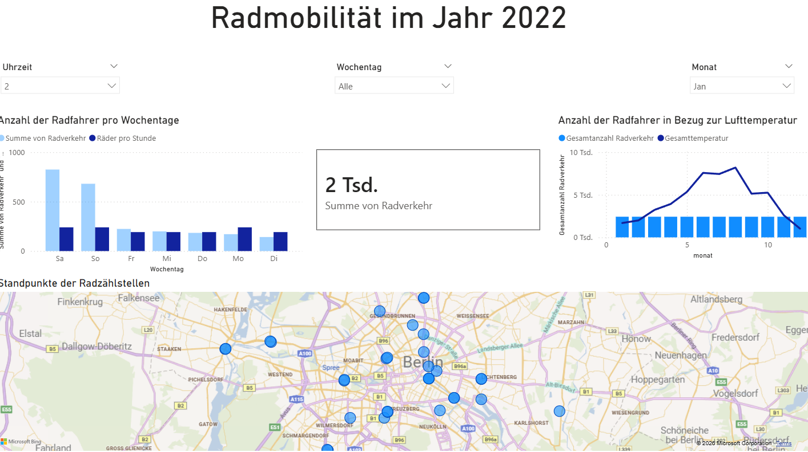

# 🚴 Power BI Dashboard – Radmobilität Berlin 2022

Dieses Power BI Dashboard visualisiert die Fahrradmobilität in Berlin im Jahr 2022. Es basiert auf öffentlich zugänglichen Zähldaten der Berliner Radzählstellen und ermöglicht eine interaktive Analyse des Radverkehrs nach Zeit, Wochentag, Monat und geografischer Lage.

---

## 📊 Dashboard-Übersicht



Das Dashboard besteht aus folgenden Komponenten:

| Visualisierung | Beschreibung |
|---|---|
| **KPI-Karte** | Zeigt die Gesamtsumme des Radverkehrs für die gewählte Filterauswahl |
| **Balkendiagramm – Wochentage** | Vergleich der Radfahreranzahl (Summe & pro Stunde) nach Wochentag |
| **Kombi-Diagramm – Temperatur** | Gesamtradverkehr im Jahresverlauf im Verhältnis zur Lufttemperatur |
| **Kartenansicht** | Geografische Standorte aller Radzählstellen in Berlin |

---

## 🔍 Interaktive Filter

Das Dashboard verfügt über drei Slicer (Filter), die alle Visualisierungen gleichzeitig steuern:

- **Uhrzeit** – Filterung nach Tagesstunde (0–23 Uhr)
- **Wochentag** – Auswahl einzelner oder aller Wochentage
- **Monat** – Monatliche Filterung (Jan–Dez)

---

## 📁 Projektstruktur

```
📦 Power-BI-Dashboard-Radmobilität-Berlin
 ┣ 📊 Radmobilitaet_Berlin_2022.pbix   # Power BI Hauptdatei
 ┣ 📂 data/
 ┃ ┗ 📄 radverkehr_berlin_2022.csv     # Rohdaten der Radzählstellen
 ┣ 🖼️ dashboard_preview.png            # Vorschaubild des Dashboards
 ┗ 📄 README.md
```

---

## 🗃️ Datenquellen

Die Daten stammen von der **Berliner Senatsverwaltung für Umwelt, Mobilität, Verbraucher- und Klimaschutz** und sind über das Open-Data-Portal Berlin öffentlich zugänglich:

- 🔗 [Radzähldaten Berlin – Open Data](https://www.berlin.de/sen/uvk/verkehr/verkehrsplanung/radverkehr/weitere-radinfrastruktur/zaehlstellen-und-fahrradbarometer/)

Die Datensätze enthalten folgende Felder:

| Feld | Beschreibung |
|---|---|
| `datum` | Datum der Messung |
| `uhrzeit` | Stunde der Messung |
| `wochentag` | Wochentag |
| `monat` | Monat |
| `radverkehr` | Anzahl der gezählten Fahrräder |
| `lufttemperatur` | Lufttemperatur in °C |
| `zaehlstelle` | Name/ID der Zählstelle |
| `lat` / `lon` | Geografische Koordinaten der Zählstelle |

---

## 🔧 Voraussetzungen

- **Microsoft Power BI Desktop** (kostenlos, [Download hier](https://powerbi.microsoft.com/de-de/desktop/))
- Windows 10/11
- Keine zusätzlichen Plugins erforderlich

---

## 🚀 Getting Started

1. Repository klonen oder als ZIP herunterladen:
   ```bash
   git clone https://github.com/Cemre25/Power-BI-Dashboard-Radmobilit-t-Berlin.git
   ```

2. Power BI Desktop öffnen

3. Datei `Radmobilitaet_Berlin_2022.pbix` öffnen

4. Falls nötig, den Datenpfad zur CSV-Datei unter **Start → Daten transformieren → Datenquelleneinstellungen** aktualisieren

5. Dashboard erkunden und Filter ausprobieren 🎉

---

## 💡 Wichtigste Erkenntnisse

- 📅 **Wochenenden (Sa/So)** verzeichnen deutlich höhere Radfahrerzahlen als Werktage
- 🌡️ **Sommerliche Temperaturen** (Monate 5–8) korrelieren stark mit erhöhtem Radverkehr
- 🗺️ Die meisten Zählstellen befinden sich im **innerstädtischen Bereich** Berlins
- 🕐 Die gefilterten Daten (Uhrzeit: 2 Uhr, Monat: Januar) zeigen mit **2 Tsd.** einen typisch niedrigen Messwert für den Wintermonat in den Nachtstunden

---

## 👩‍💻 Autorin

**Cemre** – [@Cemre25](https://github.com/Cemre25)

---

## 📄 Lizenz

Dieses Projekt steht unter der [MIT License](LICENSE).  
Die verwendeten Rohdaten unterliegen der Lizenz des Open-Data-Portals Berlin (dl-de/by-2-0).